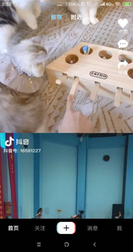
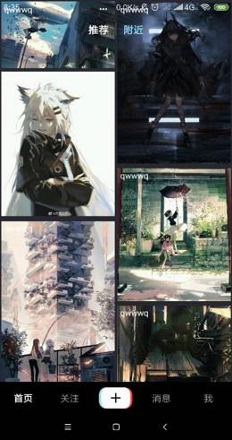

# ShortTerm_miniTikTok

Contributors: **AshenAshes**, **[RUA](https://github.com/GoldfischeRUA)**

This is our 2019 Bytedance Android summer camp final project. We implement an APP imitating TikTok. 

&emsp;

## Version

Android API 28, all dependencies hava migrate to AndroidX.

&emsp;

## Interface and feature

**SMS vertification code(MobTech support):**

**Main Activity Design**
Immersive design(The bottom black line is my phone virtual buttons), load recommended videos fetching from server when you enter(meanwhile cached in advace) and support switch by moving vertically.

**Video RecyclerView**
Here lists all videos uploaded by all users. We use Glide to load the cover.

**ijkPlayer**
Everytime you click a cover, you will enter the chosen video. We use ijkPlayer to play the video and support adjust volumn and brightness by finger just like Bilibili.

**Camera and file**
Our camera supports recording video, and once you finish a shot, you can upload it to our server and see it in the Video RecyclerView memtioned before.

**Database**
Every like is saved in native database.

